# AI Agents & Memory Architecture

A guide to understanding AI agents, agent memory systems, and the modern agent technology stack.

## Table of Contents

- [What is an AI Agent?](#what-is-an-ai-agent)
- [Memory-Augmented Agents](#memory-augmented-agents)
- [Conversation Memory](#conversation-memory)
- [Forms of Agent Memory](#forms-of-agent-memory)
- [Short-Term Memory](#short-term-memory)
- [Long-Term Memory](#long-term-memory)
- [Agent Memory Architecture](#agent-memory-architecture)
- [Why Memory Matters](#why-memory-matters)
- [The Modern Agent Stack](#the-modern-agent-stack)
- [Deterministic vs. Agent-Triggered Memory Operations](#deterministic-vs-agent-triggered-memory-operations)
- [Memory-Aware Agent](#memory-aware-agent)

---

## What is an AI Agent?

An **AI Agent** is a computational entity that:

| Capability | Description |
|---|---|
| **Perceives** | Takes in inputs from text, images, audio, APIs, sensors, etc. |
| **Reasons & Plans** | Uses a Large Language Model (LLM) as its cognitive engine |
| **Acts** | Interacts with tools, APIs, databases, and external systems |
| **Learns & Adapts** | Uses memory mechanisms to store, retrieve, and apply knowledge over time |

### High-Level Architecture

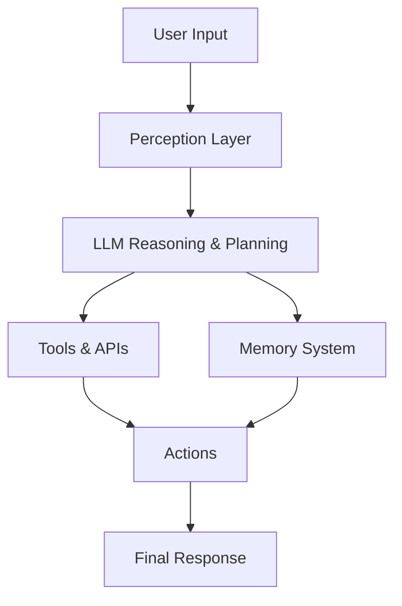

---

## Memory-Augmented Agents

Memory-Augmented Agents extend LLMs with persistent storage and retrieval, allowing them to learn and adapt over time.

### Without Memory

Every turn starts from scratch — nothing carries over.

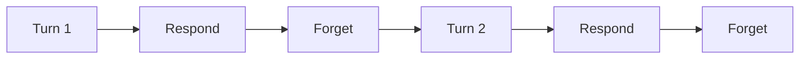

### With Memory

Information persists and informs future interactions.

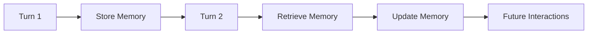

---

## Conversation Memory

Conversation memory enables an agent to maintain context during interactions. It has two parts:

### Front Memory

Information immediately available during reasoning:

- Current user query
- Recent conversation turns
- Tool outputs
- Retrieved documents
- System instructions

### Back Memory

Persisted information stored outside the immediate context window:

- User preferences
- Historical conversations
- Knowledge bases
- Task states
- Long-term memories

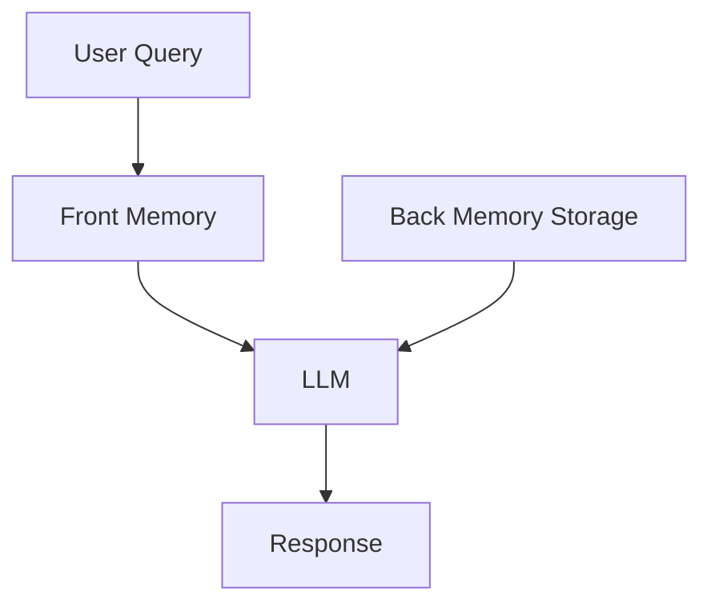

---

## Forms of Agent Memory

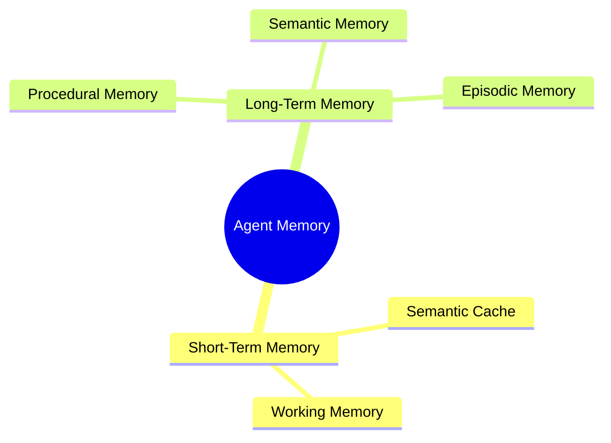

---

## Short-Term Memory

Stores information needed for the current task or session.

**Characteristics:** Temporary · Session-scoped · Fast access · Limited capacity · Frequently updated

### Semantic Cache

A cache of previously processed prompts and responses, used to:

- Reduce latency
- Lower token usage
- Avoid repeated reasoning
- Reuse similar answers

**Examples:** embedding cache, prompt cache, tool result cache, retrieval cache

### Working Memory

Temporary memory used during active reasoning and execution.

**Characteristics:** Exists during the current session · Limited by context window · Continuously updated · Supports multi-step reasoning

**Examples:** conversation history, intermediate reasoning states, tool outputs, task execution states

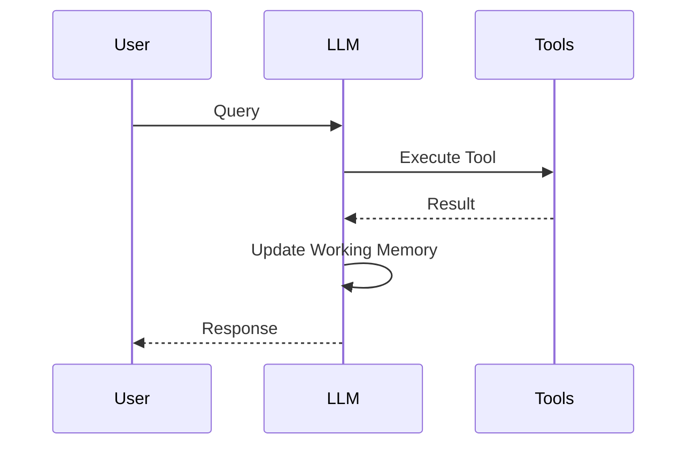

---

## Long-Term Memory

Stores information useful across sessions.

**Characteristics:** Persistent · Searchable · Cross-session · Continuously evolving

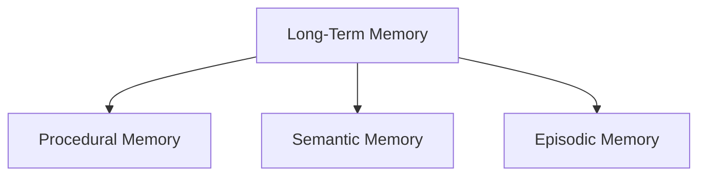

### Procedural Memory — *"How should I do something?"*

Stores information about how to perform tasks.

**Examples:** workflows, system prompts, tool usage instructions, decision rules, execution strategies, standard operating procedures (e.g. how to deploy an application, call an API, troubleshoot a server, or execute a workflow)

### Semantic Memory — *"What do I know?"*

Stores facts, concepts, and structured knowledge.

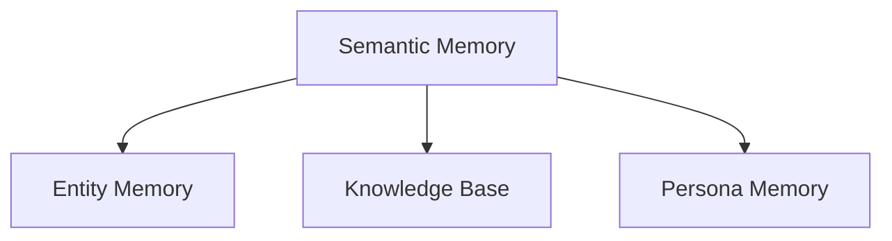

| Component | Description | Examples |
|---|---|---|
| **Entity Memory** | Information about entities and relationships | Users, organizations, projects, products, tools |
| **Knowledge Base** | Structured repository of information | Documentation, wikis, FAQs, API references |
| **Persona Memory** | Personalization information | Preferences, communication style, goals, interests, frequent tasks |

### Episodic Memory — *"What happened before?"*

Stores experiences and past events.

**Examples:** previous conversations, task histories, execution logs, past decisions, agent experiences

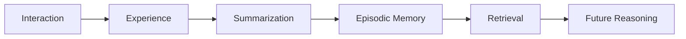

### Conversational Memory Example

Stores summaries and important information extracted from conversations.

> **Conversation:**
> `User: I am building a FastAPI-based AI agent platform.`
>
> **Stored Summary:**
> `User is building an AI agent platform using FastAPI.`

---

## Agent Memory Architecture

**Agent Memory** is the collection of architectural components, control mechanisms, storage systems, retrieval strategies, tools, and software infrastructure that enable an AI agent to:

- Persistently store information
- Organize knowledge
- Retrieve relevant context
- Update memories over time
- Reuse previous experiences
- Maintain temporal and contextual continuity
- Operate effectively across fragmented interactions and execution environments

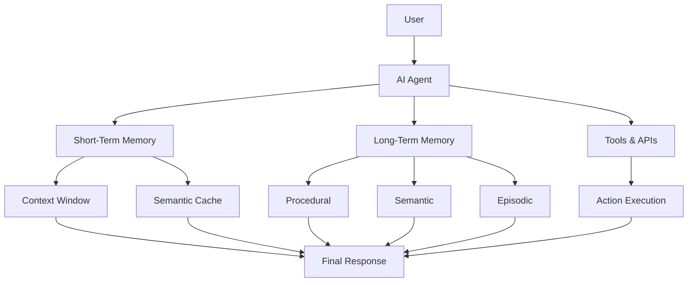

---

## Why Memory Matters

Memory enables AI agents to:

- ✅ Maintain context across conversations
- ✅ Personalize interactions
- ✅ Learn from previous experiences
- ✅ Execute complex multi-step tasks
- ✅ Reduce repeated reasoning and token usage
- ✅ Improve decision-making quality
- ✅ Support long-running workflows
- ✅ Build adaptive and intelligent behavior over time

### Core Idea

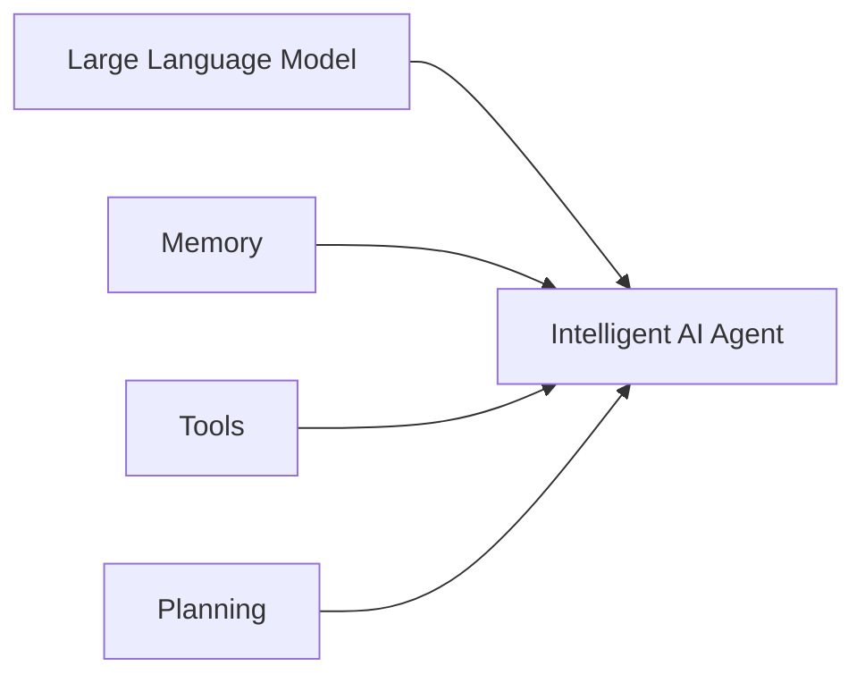

> **AI Agent = LLM + Memory + Tools + Planning**
>
> Memory transforms an LLM from a *stateless text generator* into a *stateful, adaptive, and continuously learning intelligent system*.

---

## The Modern Agent Stack

The **Modern Agent Stack** is a layered composition of technologies, frameworks, and services that collectively enable the development, deployment, and operation of an AI Agent or Agentic System.

Each layer has a distinct responsibility — from user interaction down to infrastructure.

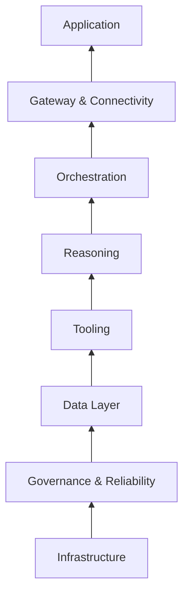

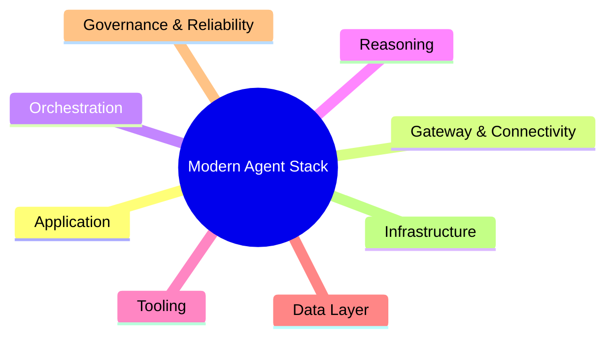

### 1. Application Layer

The interface through which users interact with the agent.

| | |
|---|---|
| **Responsibilities** | User interaction, presentation layer, session management, authentication, conversation experience, feedback collection |
| **Examples** | Web/mobile apps, chat interfaces, Slack/Discord bots, voice assistants, terminal apps, browser extensions |
| **Technologies** | React, Next.js, Flutter, Electron, Streamlit, Gradio |

### 2. Gateway & Connectivity Layer

The communication bridge between applications and agent services.

| | |
|---|---|
| **Responsibilities** | API management, authentication, routing, rate limiting, service discovery, WebSockets, external integrations |
| **Examples** | REST/GraphQL APIs, webhooks, message queues, event buses |
| **Technologies** | FastAPI, Express.js, NGINX, Kong Gateway, API Gateway, WebSockets, gRPC |

### 3. Orchestration Layer

Coordinates execution of agent workflows and multi-step tasks.

| | |
|---|---|
| **Responsibilities** | Workflow management, state management, agent coordination, task planning, multi-agent communication, event-driven execution, retry handling |
| **Examples** | Agent execution graphs, state machines, workflow engines, multi-agent systems |
| **Technologies** | LangGraph, Temporal, Apache Airflow, Celery, Prefect, Dagster |

### 4. Reasoning Layer

The cognitive engine of the system.

| | |
|---|---|
| **Responsibilities** | Reasoning, planning, decision making, problem decomposition, reflection, self-correction, context understanding |
| **Examples** | Chain-of-Thought, ReAct pattern, planning agents, reflection loops, tree search reasoning |
| **Technologies** | GPT, Claude, Gemini, DeepSeek, Llama, Mistral models |

### 5. Tooling Layer

Enables agents to perform actions beyond text generation.

| | |
|---|---|
| **Responsibilities** | Tool execution, API calling, code execution, database operations, search operations, file management, third-party integrations |
| **Examples** | Search tools, Python execution, browser automation, email/payment services, database connectors |
| **Technologies** | MCP, Function Calling, REST APIs, Playwright, Selenium, GitHub API, Google APIs |

### 6. Data Layer

Stores and retrieves information required by the agent.

| | |
|---|---|
| **Responsibilities** | Memory storage, retrieval, knowledge management, data persistence, embedding storage, search indexing |
| **Examples** | User profiles, knowledge bases, vector embeddings, agent memories, documents, conversation histories |
| **Technologies** | PostgreSQL, MongoDB, Redis, Qdrant, Pinecone, Elasticsearch, S3-compatible storage |

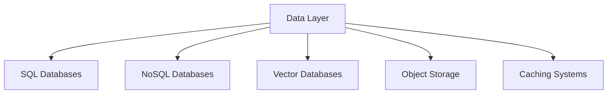

### 7. Governance & Reliability Layer

Ensures agents operate safely, reliably, and observably.

| | |
|---|---|
| **Responsibilities** | Security, guardrails, monitoring, evaluation, logging, auditing, error handling, compliance, cost management, reliability engineering |
| **Examples** | Prompt filtering, PII detection, hallucination evaluation, observability dashboards, rate limiting, retry mechanisms |
| **Technologies** | LangSmith, OpenTelemetry, Prometheus, Grafana, Sentry, MLflow, Guardrails AI |

### 8. Infrastructure Layer

Provides the computational foundation for the entire agent system.

| | |
|---|---|
| **Responsibilities** | Compute provisioning, networking, containerization, deployment, scaling, storage, GPU management, high availability, disaster recovery |
| **Examples** | Virtual machines, containers, serverless functions, Kubernetes clusters, GPU instances |
| **Technologies** | Docker, Kubernetes, Terraform, AWS, Azure, Google Cloud, Cloudflare, NVIDIA GPUs, GitHub Actions |

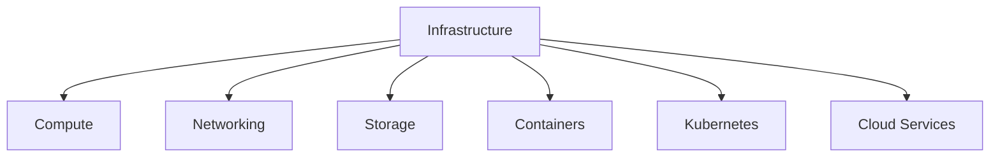

---

## End-to-End Agent Request Flow

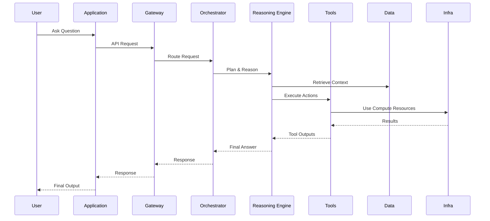

---

## Deterministic vs. Agent-Triggered Memory Operations

| Type | Description |
|---|---|
| **Deterministic** | Memory reads and writes that run automatically on a fixed schedule or predefined conditions, independent of the agent's judgment |
| **Agent-Triggered** | Memory reads/writes that the agent decides to initiate based on its own real-time assessment |

### Key Definitions

- **Memory Unit** — The smallest atomic piece of stored information, represented with a minimal set of attributes so it can be captured, retrieved, and updated by a memory-augmented agent.
- **Context Engineering** — The practice of optimally selecting and shaping the information placed into an LLM's context window so it can perform a task reliably, while explicitly accounting for context window limits and model constraints.

---

## Memory-Aware Agent

The evolution from a basic memory-augmented agent to a fully memory-aware agent:

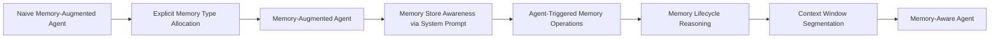

| Stage | Description |
|---|---|
| **Naive Memory-Augmented Agent** | Basic agent with memory bolted on, no structure |
| **Explicit Memory Type Allocation** | Memory is categorized into distinct types (short-term, long-term, etc.) |
| **Memory-Augmented Agent** | Agent actively uses categorized memory in reasoning |
| **Memory Store Awareness via System Prompt** | Agent is informed of available memory stores through its instructions |
| **Agent-Triggered Memory Operations** | Agent decides when to read/write memory based on real-time assessment |
| **Memory Lifecycle Reasoning** | Agent reasons about creating, updating, and expiring memories |
| **Context Window Segmentation** | Context window is partitioned to separate memory types and working content |
| **Memory-Aware Agent** | Fully realized agent with deliberate, structured memory management |

---

## Putting It All Together

```text
Application
      ↑
Gateway & Connectivity
      ↑
Orchestration
      ↑
Reasoning
      ↑
Tooling
      ↑
Data Layer
      ↑
Governance & Reliability
      ↑
Infrastructure
```

An **AI Agent System** emerges when these layers work together to provide:

> **User Experience + Connectivity + Workflow Coordination + Reasoning + Tool Usage + Memory + Reliability + Scalable Infrastructure**
